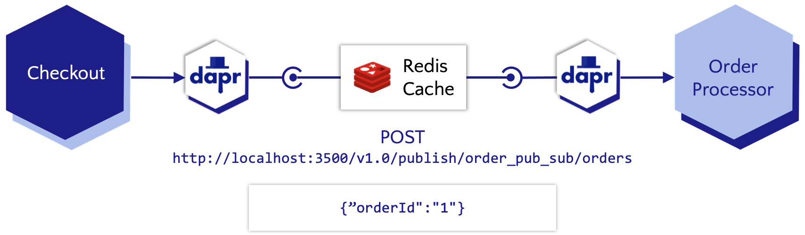

# Microservice communication using pubsub (async)



In this quickstart, you'll create a publisher microservice and a subscriber microservice to demonstrate how Dapr enables a publish-subcribe pattern. The publisher will generate messages of a specific topic, while subscribers will listen for messages of specific topics. See [Why Pub-Sub](#why-pub-sub) to understand when this pattern might be a good choice for your software architecture.

For more details about this quickstart example please see the [Pub-Sub Quickstart documentation](https://docs.dapr.io/getting-started/quickstarts/pubsub-quickstart/).

Visit [this](https://docs.dapr.io/developing-applications/building-blocks/pubsub/) link for more information about Dapr and Pub-Sub.

> **Note:** This example leverages the Dapr client SDK.  If you are looking for the example using only HTTP `requests` [click here](../http).

This quickstart includes one publisher:

- Node client message generator `checkout` 

And one subscriber: 
 
- Node subscriber `order-processor`

### Pre-requisites
For this example, you will need:
- [Dapr CLI](https://docs.dapr.io/getting-started).
- [Latest Node.js (v14.16.1 +)](https://nodejs.org/download/).
<!-- IGNORE_LINKS -->
- [Docker Desktop](https://www.docker.com/products/docker-desktop)
<!-- END_IGNORE -->

### Run Node message subscriber with Dapr

1. Install dependencies in a new terminal: 

<!-- STEP
name: Install Node dependencies
-->

```bash
cd ./order-processor
npm install
```
<!-- END_STEP -->
2. Run the Node subscriber app with Dapr: 

<!-- STEP
name: Run Node subscriber
expected_stdout_lines:
  - '== APP == Subscriber received: {"orderId":2}'
  - "Exited App successfully"
expected_stderr_lines:
working_dir: ./order-processor
output_match_mode: substring
background: true
sleep: 10
-->
    
```bash
dapr run --app-port 5001 --app-id order-processing --app-protocol http --dapr-http-port 3501 --components-path ../components -- npm run start
```

<!-- END_STEP -->

### Run Node message publisher with Dapr

3. Install dependencies in a new terminal: 

<!-- STEP
name: Install Node dependencies
-->

```bash
cd ./checkout
npm install
```
<!-- END_STEP -->
4. Run the Node publisher app with Dapr: 

<!-- STEP
name: Run Node publisher
expected_stdout_lines:
  - '== APP == Published data: {"orderId":2}'
  - '== APP == Published data: {"orderId":3}'
  - "Exited App successfully"
expected_stderr_lines:
working_dir: ./checkout
output_match_mode: substring
background: true
sleep: 10
-->
    
```bash
dapr run --app-id checkout --app-protocol http --components-path ../components -- npm run start
```

<!-- END_STEP -->

```bash
dapr stop --app-id checkout
dapr stop --app-id order-processor
```

### Deploy to Azure for dev-test

NOTE: make sure you have Azure Dev CLI pre-reqs [here](https://learn.microsoft.com/en-us/azure/developer/azure-developer-cli/install-azd?tabs=winget-windows%2Cbrew-mac%2Cscript-linux&pivots=os-windows) and are on version 0.9.0-beta.3 or greater.

5. Run the following command to initialize the project. 

```bash
azd init --template https://github.com/Azure-Samples/pubsub-dapr-nodejs-servicebus
``` 

This command will clone the code to your current folder and prompt you for the following information:

- `Environment Name`: This will be used as a prefix for the resource group that will be created to hold all Azure resources. This name should be unique within your Azure subscription.

6. Run the following command to package a deployable copy of your application, provision the template's infrastructure to Azure and also deploy the application code to those newly provisioned resources.

```bash
azd up
```

This command will prompt you for the following information:
- `Azure Location`: The Azure location where your resources will be deployed.
- `Azure Subscription`: The Azure Subscription where your resources will be deployed.

> NOTE: This may take a while to complete as it executes three commands: `azd package` (packages a deployable copy of your application),`azd provision` (provisions Azure resources), and `azd deploy` (deploys application code). You will see a progress indicator as it packages, provisions and deploys your application.
